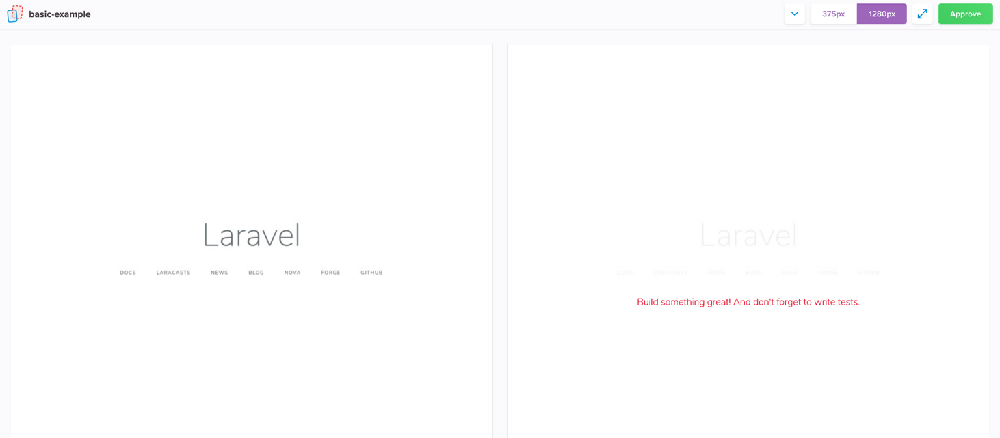

# Snapshot testing for Laravel Dusk
[](https://packagist.org/packages/stechstudio/laravel-percy)
[](https://packagist.org/packages/stechstudio/laravel-percy)

[Laravel Dusk](https://laravel.com/docs/master/dusk) is a fantastic way to write browser tests for your Laravel app. 

This package extends Dusk with the ability to do visual diffs, by using the [Percy visual testing](https://percy.io/) platform.

## Percy setup

1. Sign up for a free account at [percy.io](https://percy.io) and create your first project.

2. Install the [`@percy/agent`](https://www.npmjs.com/package/@percy/agent) package.

    ```
    npm install --save-dev @percy/agent
    ```
    
3. Set up your [`PERCY_TOKEN` environment variable](https://docs.percy.io/docs/environment-variables). 

    ```
    $ export PERCY_TOKEN=aaabbbcccdddeeefff
    ```
    
## Package setup

1. Install with composer.

    ```
    composer require stechstudio/laravel-percy --dev
    ```
    
2. If you're running Laravel 5.5, you're done. For Laravel 5.4 and earlier, add the service provider to `config/app.php`.

    ```php
    'providers' => [
        ...
        STS\Percy\PercyServiceProvider::class,
    ],
    ``` 
    
## How to use

Make sure you have completed the [Laravel Dusk installation steps](https://laravel.com/docs/master/dusk#installation), and you can run the example test with `php artisan dusk`.

Open the example test at `tests/Browser/ExampleTest.php`. Add a call to `percySnapshot()` right after the `visit`, and pass in a name for your snapshot.

```php
public function testBasicExample()
{
    $this->browse(function (Browser $browser) {
        $browser->visit('/')
            ->percySnapshot('basic-example') // <-- add this
            ->assertSee('Laravel');
                
    });
}
```

Now go run your test:

```
php artisan dusk
```

If all goes well, you should see output similar to this:

```
$ php artisan dusk
[percy] created build #1
[percy] percy has started.

[percy] snapshot taken: 'basic-example'
.                                                                   1 / 1 (100%)

Time: 2.37 seconds, Memory: 22.00MB

OK (1 test, 1 assertion)
[percy] stopping percy...
[percy] waiting for 1 snapshots to complete...
[percy] done.
[percy] finalized build #1
```

Now go check out your Percy dashboard, and you should see the new build. 


At this point it won't have anything to compare the snapshot to. But if you go modify the `welcome.blade.php` file and run it again, you'll get a nice visual diff of your change.



## Skip snapshots

Sometimes you may want to run dusk tests without taking snapshots. You can use the `--without-percy` option when running `dusk` or `dusk:fails` to disable percy snapshots. 