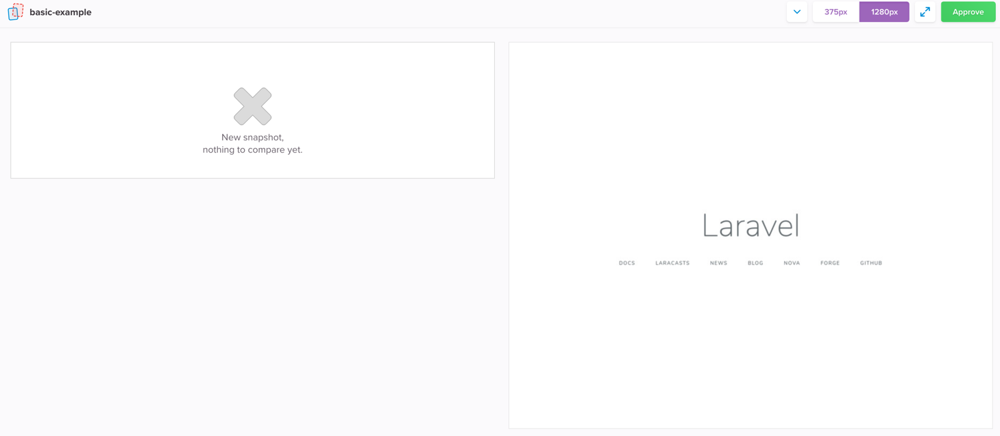

# Snapshot testing for Laravel Dusk
[](https://packagist.org/packages/stechstudio/laravel-percy)
[](https://packagist.org/packages/stechstudio/laravel-percy)

Laravel makes it easy to write tests. Support for unit and feature (integration) testing is provided out of the box. Additionally, you can control a real browser for end-to-end testing with [Laravel Dusk](https://laravel.com/docs/master/dusk).

This package extends Dusk with the ability to do visual diffs with the [Percy visual testing](https://percy.io/) platform. 

This form of testing is commonly referred to as snapshot testing, and is very useful in cases where you want to guard against unexpected changed to your UI. Snapshot testing is not meant to replace your unit/feature/browser tests, but rather provide another tool in your testing toolbox. 

## Installation and setup

We are assuming you have already completed the [Laravel Dusk installation steps](https://laravel.com/docs/master/dusk#installation), and you can run the example test with `php artisan dusk`.

Next:

1. Sign up for a free account at [percy.io](https://percy.io) and create your first project.

2. Put your `PERCY_TOKEN` in your Laravel .env file. If you are using [specific dusk environment files](https://laravel.com/docs/5.7/dusk#environment-handling), make sure to include this token.

    ```
    PERCY_TOKEN=aaabbbcccdddeeefff
    ```

3. Install the [`@percy/agent`](https://www.npmjs.com/package/@percy/agent) NPM package.

    ```
    npm install --save-dev @percy/agent
    ```
    
4. Install this composer package.

    ```
    composer require stechstudio/laravel-percy --dev
    ```

## How to use

You can now call `->percySnapshot('snapshot-name')` on the browser instance in any of your dusk tests. 

Then run your test suite like your normally would with `php artisan dusk`.

## Options

Sometimes you may want to run dusk tests without taking snapshots. You can use the `--without-percy` option when running `dusk` or `dusk:fails` to disable percy snapshots. 

## Example

Open the example test at `tests/Browser/ExampleTest.php`. Add a call to `percySnapshot()` right after the `visit`, and pass in a name for your snapshot.

```php
public function testBasicExample()
{
    $this->browse(function (Browser $browser) {
        $browser->visit('/')
            ->percySnapshot('basic-example') // <-- add this
            ->assertSee('Laravel');
                
    });
}
```

Now go run your test:

```
php artisan dusk
```

If all goes well, you should see output similar to this:

```
$ php artisan dusk
[percy] created build #1
[percy] percy has started.

[percy] snapshot taken: 'basic-example'
.                                                                   1 / 1 (100%)

Time: 2.37 seconds, Memory: 22.00MB

OK (1 test, 1 assertion)
[percy] stopping percy...
[percy] waiting for 1 snapshots to complete...
[percy] done.
[percy] finalized build #1
```

Now go check out your Percy dashboard, and you should see the new build. 



At this point it won't have anything to compare the snapshot to. But if you go modify the `welcome.blade.php` file and run it again, you'll get a nice visual diff of your change.


